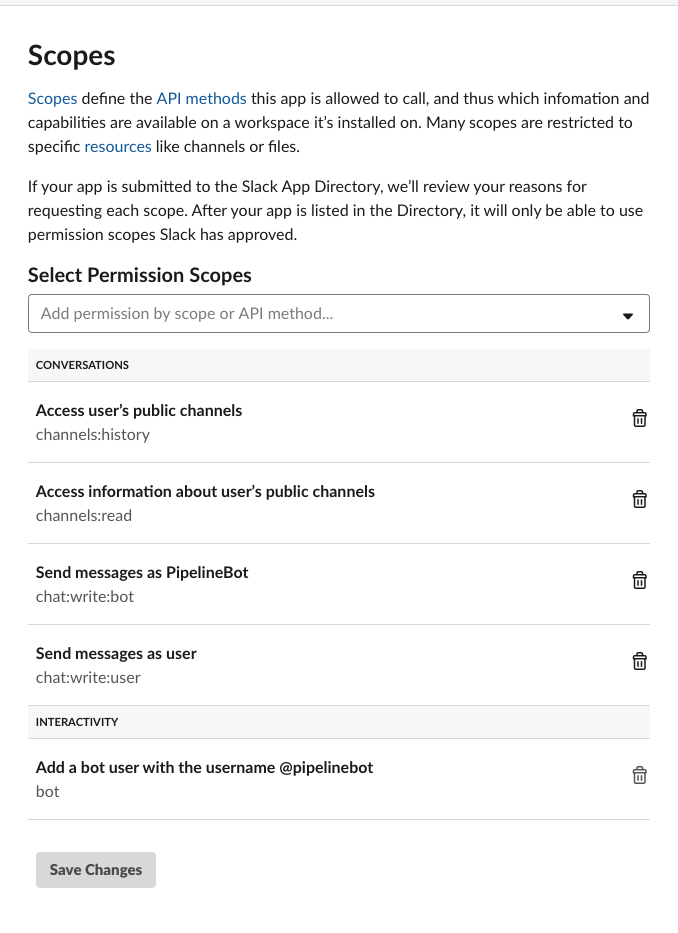

# aws-codepipeline-slack-notifier

notifie codepipeline status to your slack using AWS Lambda.
This project overwrite existing message, so you can send dynamic status to message in one slack message.

Sample


this repo is base on [ogrodnek/code-pipeline-slack](https://github.com/ogrodnek/code-pipeline-slack)

- Clean up and re-write code.
- Delete not using code and modified the code to comply with PEP8 convention.
- Change Python Version from 2.7 to 3.6
- Change Deploy script from AWS CloudFormation to Serverless framework
- Fix Bugs
  - Status role back bug
    - Case: If INSTALL event received and DOWNLOAD_SOURCE event received, build status roll back from INSTALL to DOWNLOAD_SOURCE and never update.
    - status: Solved
  - Last build status not change to success icon.
    - Case: COMPLETED or FINALIZING's status is not change from 'in progress' to 'success'.
    - status: Solved

## Feature

- CodePipeline status to slack message
- One message per one pipeline execution.
- Codebuild dashboard link button.
- All pipeline's status integrate to slack. 

## How to install

### 1. Register Custom Emoji

If you want to use custom emoji, you need to download emoji and register in your slack.

custom emoji samples: <https://slackmojis.com/categories/7-party-parrot-emojis>

Then, register your custom emoji to `.env`


### 2. Config Slack Bot

**Token**

<https://api.slack.com/apps>

install your bot to your workspace

Click your app > OAuth & Permissions

Copy **OAuth Access** **Token** and **Bot User OAuth Access** **Token** and paste it to .env


**Permission**

you have to set bot's api permission scopes.

Click your app > OAuth & Permissions

Add Permissions

- channels:history
- channels:read
- chat:write:bot
- chat:write:user



### 3. .env

you need to register your environment variables in .env file.

- stage: your cloud stage environment. like `dev`, `prd`. This parameter insert to lambda funciton name like `codepipeline-slack-dev-notifier`
- s3_bucket: s3 bucket name. Serverless artifacts will be uploaded to this bucket.
- SLACK_TOKEN: Slack token. OAuth Access Token.
- SLACK_BOT_TOKEN:  Slack token. Bot User Oauth Access Token.
- SLACK_CHANNEL: slack channel to send pipeline status message. defualt is `builds`
- SLACK_BOT_NAME: your slack bot name. default is `PipelineBot`
- SLACK_BOT_ICON: your slack bot's icon. default is `:robot_face:`
- SLACK_IN_PROGRESS_EMOJI: emoji for codebuild in progress phase. start and endswith `:`


### 4. Serverless install and deploy

```bash
npm insatll -g serverless
npm install
```

login to AWS in serverless and deploy.

Document (aws credential for serverless): <https://serverless.com/framework/docs/providers/aws/guide/credentials/>

```bash
serverless deploy
```


Done!

